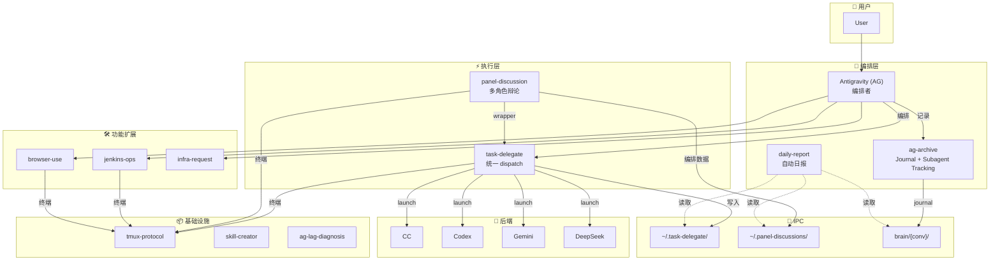

# Agent Skills — 多 Agent 协作技能生态系统

> 跨项目的 agent 技能库。AG (Antigravity) 担任编排者，通过 task-delegate 统一调度多个后端 agent，各技能互相协作，形成完整的自动化工作流。

## 核心理念

**AG = 编排者 (Copilot)**，不亲自做重活，而是：

1. 理解用户意图 → 拆解任务 → 分派给最合适的后端
2. 监控执行 → 验证结果 → 记录过程
3. 维持对话上下文不被污染，使任务链路可以无限延长

## 后端分派策略

| 后端 | 擅长领域 | 典型场景 |
|------|---------|---------|
| **CC (Claude Code)** | 编码 | 实现功能、修复 bug、重构代码 |
| **Codex (OpenAI)** | 推理 & 长链路思考 | 复杂分析、调试、架构决策、panel 辩论 |
| **Gemini (Google)** | 多模态 | 图片分析、浏览器自动化、OCR |
| **DeepSeek** | 性价比 | 快速生成、简单分析、批量处理 |

> AG 自身只写验证代码和编排脚本，**一旦涉及编码实现就委派**。这保证 AG 上下文不被实现细节污染，任务链路可以变得极长且复杂。

## 技能协作架构

### 数据流

| 存储 | 用途 | 写入者 | 消费者 |
|------|------|--------|--------|
| `~/.task-delegate/` | 所有 subagent 执行记录（Single Source of Truth） | task-delegate | daily-report, ag-archive, ag_retro.py |
| `~/.panel-discussions/` | Panel 编排数据（topic, summary, manifest） | panel-discussion | daily-report |
| `brain/{conv_id}/` | 对话 journal + subagent tracking | ag-archive | daily-report |

**双向链接**：`execution_record.json` 的 `source_conversation` → `brain/{conv_id}/`，journal 的 `[subagent]` tag → `~/.task-delegate/{task_id}/`

## 技能清单

### 基础设施

| Skill | Description |
|-------|-------------|
| [tmux-protocol](tmux-protocol/) | 强制终端协议 — 所有 terminal 命令必须走 tmux，防止 agent hang |
| [skill-creator](skill-creator/) | 技能构建标准 — 六段式 SKILL.md + README.md 双层文档体系 |
| [ag-lag-diagnosis](ag-lag-diagnosis/) | AG IDE 性能诊断 — polling storms, 大 .pb 文件, renderer blocking |

### 编排执行

| Skill | Description |
|-------|-------------|
| [task-delegate](task-delegate/) | 统一任务委派 — prompt, launch, monitor, verify (CC/Codex/Gemini/DeepSeek) |
| [agent-panel-discussion](agent-panel-discussion/) | 多角色辩论 — 怀疑/务实/乐观三方辩论，多轮反驳 + 信心评分 |

### 记录分析

| Skill | Description |
|-------|-------------|
| [ag-archive](ag-archive/) | 对话归档 — Journal 协议 + `[subagent]` tracking + conversation_summary |
| [daily-report](daily-report/) | 自动日报 — 扫描 3 个数据源，按项目分组，附 AI 改进建议 |

### 功能扩展

| Skill | Description |
|-------|-------------|
| [browser-use](browser-use/) | 浏览器自动化 — browser-use + Gemini Flash，比 AG 内置快 2-9x |
| [jenkins-ops](jenkins-ops/) | Jenkins CI/CD — 触发、监控、配置、排障 |
| [infra-request](infra-request/) | 基建需求 — GitHub Issues 提交 + 验证 + Tool Integration Plan |

## 技能间协作关系

| 协作模式 | 说明 |
|---------|------|
| `panel-discussion` → `task-delegate` | panel_launch.sh 是 task_launch.sh 的 thin wrapper |
| `ag-archive` → `task-delegate` | journal `[subagent]` tag 通过 task_id 关联执行记录 |
| `daily-report` → `ag-archive` + `task-delegate` + `panel-discussion` | 扫描 3 个 IPC 目录生成日报 |
| `all terminal skills` → `tmux-protocol` | 所有涉及终端的操作必须遵循 tmux 协议 |
| `all skills` → `skill-creator` | 文档标准：SKILL.md (agent) + README.md (human) |
